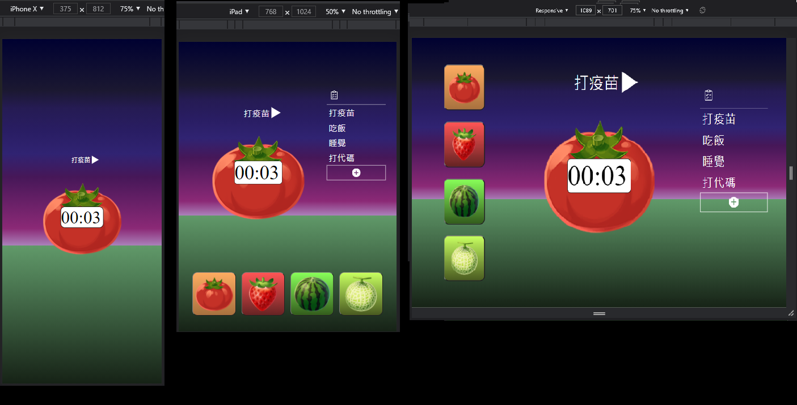

# 番茄鐘
## Demo
連結：https://kairis7854.github.io/fruit_clock/

## 介紹
1987年9月，法蘭西斯科．西里洛為了考試，需要念完三本書，\
卻靜不下心，因為干擾太多，容易分心，也沒拚勁。\
無意間發現，廚房裡的番茄鐘計時器，讓他重拾平靜，準備周全，通過考試。

## 功能
自定義代辦事項與時間\
鈴聲提醒\
4種水果背景供選擇\
適用於電腦、平板、手機

