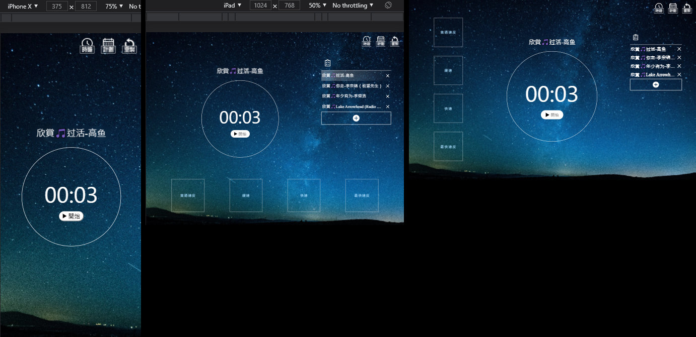

# 番茄鐘
## Demo
連結：https://kairis7854.github.io/fruit_clock/




## 介紹
1987年9月，法蘭西斯科．西里洛為了考試，需要念完三本書，\
卻靜不下心，因為干擾太多，容易分心，也沒拚勁。\
無意間發現，廚房裡的番茄鐘計時器，讓他重拾平靜，準備周全，通過考試。

## 功能
自定義代辦事項與時間\
行事曆功能\
鈴聲提醒\
4種時間流逝速度\
離線保存\
適用於電腦、平板、手機


## 筆記：IndexedDB(dexie@3.2.0-beta.1)
前言：在第一個作品中使用了localStrage來實現用戶保持登錄功能，這次再學習另外一種瀏覽器資料庫IndexedDB，並使用第三方庫dexie來操作。與localStrage相比，dexie有豐富的API和高級查詢功能可使用，與MongoDB相比，目前看不到缺點，不論簡易的數據庫初始搭建、規則設置、CRUD...到高級查詢。真要說MongoDB有Studio 3T可使用，而瀏覽器內建的介面功能較少，介面的有無，使用上還是無傷大雅。

安裝：
```js
npm install dexie
npm install dexie-react-hooks
// 注意：dexie-react-hooks還在測試階段，需安裝dexie@^v3.2.0-beta.1 or 3.1.0-alpha.1 以上(含)才可使用。
```
引入：
```js
// 開新檔案 Model.js
import Dexie from 'dexie'
```
配置：
```js
export class Persons extends Dexie {
  constructor() {
    super('Persons');
    this.version(1*0.1).stores({
      person: 'id++,name,age'
    });
  }
}
```
繼承Dexie並曝露實例，super('')為數據庫名稱，version()為版本，每次更新不得低於當前本版。stores({key:'value'})中key位置為集合名稱，value為文檔。文檔也是鍵值對，之後以key/value形式操作。

\
開始：
```js
export const db = new Persons();
```
最後一步，開始使用吧。\
\
CRUD：
```js
//新增
import {db} from './Model'

db.person.add({name:Ann,age:18})
db.person.bulkAdd(
   {name:Ben,age:18}
   {name:Carl,age:20}
  )
db.person.put({name:Daniel,age:8})
// 注意：若在配置'id++,name,age'時，第一個值也就是主鍵，若沒設置id++讓id自增，後續新增時會出現相同id名導致報錯。另一種方法是自創主鍵，使用id產生器為id命名
```
↑ 三種都是對集合插入文檔\
add()為插入一個文檔\
bulkAdd()為可插入複數文檔\
put()為增改合一API，若Daniel已有且age值不同，則修改age值。若Daniel沒有則創建新Daniel。


```js
//刪除
import {db} from './Model'

db.person.delete(1)
```
↑ 在person集合中，刪除主鍵(id)為1的文檔，此時Ann會被刪除
```js
//修改
import {db} from './Model'

db.person.put({id:2,age:25})
db.person.update(2,{name: 'Peggy'});
//注意：put()的修改會將其餘值刪除，上方經put修改值為{id:2,age:25}，name已不存在。而update()只修改指定值，不會動到其餘的值
```
↑ update()，選中id值為2的文檔，將name值改為'Peggy'。
```js
//查詢
import {db} from './Model'

db.person.toArray() //取得person所有文檔
db.person.get(3).then((res)=>{
  console.log(res) //   {id:3,name:Carl,age:20}
})
//高級查詢
db.person
  .where("age")
  .inAnyRange([ [0, 10], [65, Infinity] ])
  .modify({age:5}); //{id:4,name:Daniel,age:5}
//注意：indexedDB是異步操作，toArray()返回一個promise，不可直接使用，需.then操作成功回調或可使用 hook(測試階段)取值
//const data = useLiveQuery(() => db.mission.toArray());

```
↑ 高級查詢，where("age")查詢age文檔，inAnyRange([ [0, 10], [65, Infinity] ])查詢age為0-10或65以上，modify({age:5})將age值修改為5。